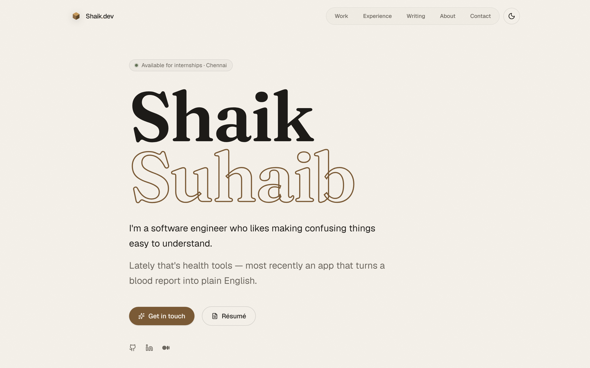

# Shaik Mohammed Suhaib — portfolio

Personal site at **[shaikuhaibdev.vercel.app](https://shaikuhaibdev.vercel.app)**.

Single-page scroll with deeper case studies for each project. Warm editorial palette (paper + walnut) with a light/dark toggle — serif for display moments, sans for reading.



---

## What's in it

- **Narrative arc, not a résumé dump**: hero → approach (how I think) → work → experience → writing → about → contact. The belief comes first, so the projects below read as evidence. Each section carries an indexed `/ name` monospace label, with right-aligned jump links where they help ("All on GitHub", "Read on Medium").
- **Case study pages** at `/projects/[slug]` — statically generated. Each lays out problem, approach, keyed decisions with rationale, and outcome (structure varies per project — no forced "lessons" list).
- **Editorial system** — warm paper/walnut palette, subtle printed-paper grain, Fraunces serif reserved for display moments, and semantic color roles (walnut = interaction, moss = positive). Light/dark toggle with no-flash init.
- **Outlined serif masthead** — the hero name is set in Fraunces with a transparent fill and a stroked outline, for a printed editorial feel.
- **Magnetic CTAs** — "Get in touch" and "Résumé" track the cursor with spring physics.
- **Hardened contact form**: Zod-validated, Resend-delivered, Upstash-rate-limited (in-memory fallback for local dev), honeypot anti-spam, control-character stripping to defend against header injection, strict CORS validation.
- **Accessibility**: WAI-ARIA tab pattern with roving focus, skip-to-content link, `prefers-reduced-motion` respected, focus-visible outlines, semantic HTML, JSON-LD `Person` schema.

## Tech stack

- **Framework**: Next.js 16 App Router (Turbopack)
- **UI**: React 19, Tailwind CSS v4 with `oklch` design tokens, `motion` for animations
- **Backend**: Resend (transactional email), Upstash Redis (distributed rate limiting), Zod (request validation)
- **Hosting**: Vercel
- **Fonts**: Geist Sans + Geist Mono + Fraunces (display serif) via `next/font/google`
- **Tooling**: ESLint (`next/core-web-vitals`) + Prettier

## Local development

```bash
npm install
npm run dev
```

Copy `.env.example` to `.env.local` and fill in the keys for `RESEND_API_KEY`, `UPSTASH_REDIS_REST_URL`, and `UPSTASH_REDIS_REST_TOKEN` if you want the contact form to deliver mail and rate-limit against a shared store. Without them, the form still works locally — Resend cleanly 503s and the limiter falls back to per-worker in-memory.

## Layout

```
app/
├── api/contact/          POST endpoint: Zod + rate limit + Resend
├── projects/[slug]/      Statically generated case study pages
├── layout.tsx            Fonts, metadata + JSON-LD, paper-grain background
└── page.tsx              The one-page scroll
components/ui/
├── work-stack-link.tsx   FeaturedProject + ProjectsList
├── magnetic-link.tsx     Cursor-following springs
├── theme-toggle.tsx      Light/dark editorial toggle (no-flash init)
├── nav.tsx, contact-form.tsx, status-pill.tsx, ...
data/site.ts              Single source of truth for all content
```

## Contact

- Email: [shaiksuhaib360@gmail.com](mailto:shaiksuhaib360@gmail.com)
- GitHub: [@RIxiV1](https://github.com/RIxiV1)
- LinkedIn: [in/shaiksuhaib](https://www.linkedin.com/in/shaiksuhaib)
- Medium: [@shaiksuhaib360](https://medium.com/@shaiksuhaib360)

---

MIT © Shaik Mohammed Suhaib
