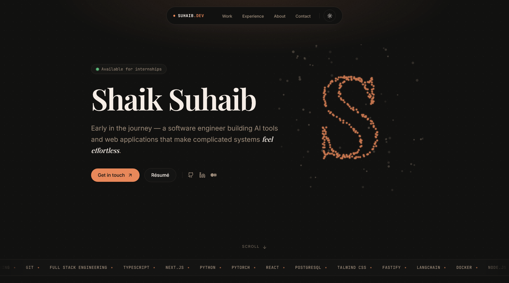

# Shaik Mohammed Suhaib ✦ Portfolio

Welcome to my slice of the internet: **[shaiksuhaibdev.vercel.app](https://shaiksuhaibdev.vercel.app)**.

This isn't just another generic template. It's a hand-crafted, single-page experience that dives deep into case studies for my favorite projects. The vibe? Clean, premium, and distraction-free. Think near-monochrome aesthetics with a single, unapologetic indigo signal cutting through the noise (in both light and dark modes, naturally).



---

## ⚡ The Good Stuff

I built this to be fast, accessible, and an absolute joy to interact with. Here's what makes it tick:

- **The Flow**: It's a journey. Hero → Work → Experience → About → Contact, indexed neatly (`01 —— Work`). Clicking into a case study? You'll get a buttery smooth fade-up transition. No jarring page reloads here.
- **The Look**: Restrained but powerful. Geist typography, medium radius corners, a subtle dotted-grid layered with film-grain, and a soft spotlight effect in the hero. Oh, and the light/dark toggle doesn't flashbang you on load.
- **The Work**: I let the products speak for themselves with image-led cards. Each project gets a punchy results line, tech stack chips, and all the relevant links. Hover over them and feel the depth.
- **Deep Dives**: Case studies at `/projects/[slug]` aren't just fluff. They're statically generated breakdowns of the *Problem*, *Approach*, *Key Decisions* (and why I made them), and the final *Outcome*.
- **Spring Physics**: The hero buttons are magnetic. They track your cursor. Go ahead, play with them. 
- **Bulletproof Contact Form**: I don't mess around with spam. It's Zod-validated, delivered via Resend, and rate-limited at the edge with Upstash (with an in-memory fallback for local dev). Add in a honeypot, control-character stripping (bye, header injection), and strict CORS. Good luck, bots.
- **Accessibility as a Standard**: Skip-to-content links, `prefers-reduced-motion` honored across the board, semantic HTML, rich JSON-LD `Person` schema, and proper focus states. It works for everyone.

## 🛠️ The Stack

I chose tools that get out of my way and let me build fast:

- **Framework**: Next.js 16 App Router (running on Turbopack because speed matters)
- **UI Engine**: React 19, Tailwind CSS v4 for design tokens, and `motion` for the buttery animations.
- **Backend Muscle**: Resend (email), Upstash Redis (rate limiting), Zod (because we don't trust user input).
- **Hosting**: Vercel. Push to main and relax.
- **Typography**: Geist Sans + Geist Mono (served optimally via `next/font/google`).

## 🚀 Run It Locally

Wanna see how the sausage is made? 

```bash
npm install
npm run dev
```

To test the contact form, copy `.env.example` to `.env.local` and drop in your `RESEND_API_KEY`, `UPSTASH_REDIS_REST_URL`, and `UPSTASH_REDIS_REST_TOKEN`. 
*Pro-tip: Even without them, the form still runs locally. Resend will gracefully 503 and the rate limiter will just use memory instead of Redis.*

## 🗺️ Architecture

Here's the map. The codebase is organized to make sense immediately:

```text
app/
├── api/contact/          POST endpoint: Validated, rate-limited, and sent.
├── projects/[slug]/      SSG case studies.
├── layout.tsx            The shell: Fonts, metadata, JSON-LD, and that sweet grid background.
├── template.tsx          The magic behind the page transitions.
└── page.tsx              The main event. One page to rule them all.

components/ui/
├── work-stack-link.tsx   The image-led project cards.
├── magnetic-link.tsx     Those springy, cursor-following buttons.
├── reveal.tsx            Staggered entrance animations.
├── nav.tsx, contact-form.tsx, theme-toggle.tsx, ...

data/
└── site.ts               The brain. A single source of truth for all content. Change it here, it updates everywhere.
```

## 📬 Let's Talk

I'm always open to talking about tech, design, or new opportunities.

- **Email**: [shaiksuhaib360@gmail.com](mailto:shaiksuhaib360@gmail.com)
- **GitHub**: [@RIxiV1](https://github.com/RIxiV1)
- **LinkedIn**: [in/shaiksuhaib](https://www.linkedin.com/in/shaiksuhaib)
- **Medium**: [@shaiksuhaib360](https://medium.com/@shaiksuhaib360)

---
*Built with intent. MIT © Shaik Mohammed Suhaib*
